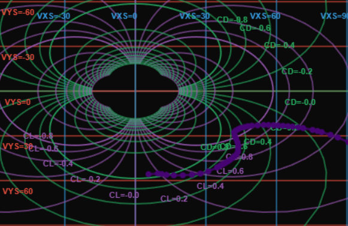
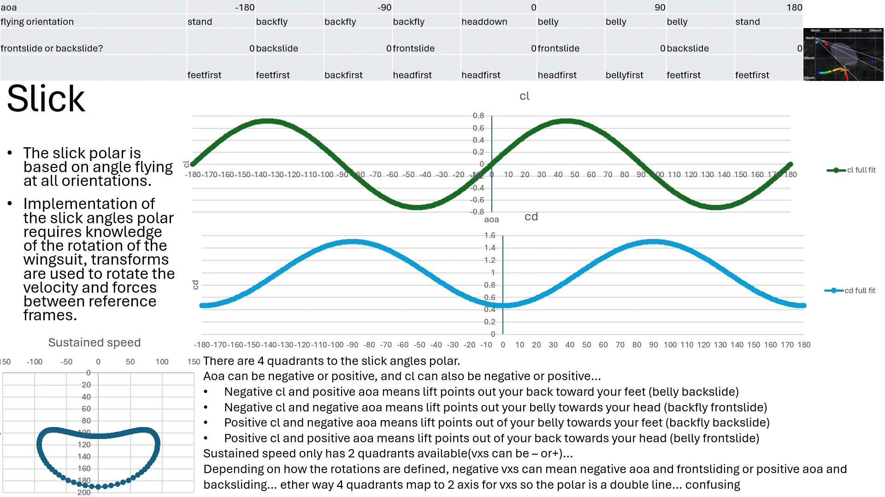

# Sustained Speeds Chart

<div align="center">



*Interactive aerodynamic visualization showing the transformation between speed-space and coefficient-space*

[](https://developer.mozilla.org/en-US/docs/Web/JavaScript)
[](https://developer.mozilla.org/en-US/docs/Web/API/Canvas_API)
[](LICENSE)

</div>

---

An interactive aerodynamic visualization tool that seamlessly transforms between speed-space and coefficient-space coordinate systems. Built for analyzing sustained flight performance with smooth, real-time interpolation between fundamentally different axis representations.

## What Are Sustained Speeds?

**Sustained speeds** are the constant velocities achieved during steady-state flight when all accelerations are zero. At these conditions, aerodynamic forces perfectly balance gravity, creating a direct mathematical relationship between flight speed and aerodynamic coefficients.  The relationship extends beyond the steady-state case, and can be used to calculate sustained speeds for any velocity and acceleration

This tool visualizes that relationship by morphing between two equivalent representations:
- **Speed Space**: Where you see horizontal speed (Vxs) and vertical speed (Vys)
- **Coefficient Space**: Where you see lift coefficient (CL/KL) and drag coefficient (CD/KD)

Every point on the chart represents the same physical flight condition—just viewed through different mathematical lenses.

---

## Theory: The Physics of Sustained Flight

> **Attribution**: The wingsuit equations presented here were originally derived by **YURI_BASE** in the legendary thread  
> *["The Wingsuit Theory, or How to Fly Like an Eagle While Barely Moving on the Couch"](https://www.dropzone.com/forums/topic/97830-the-wingsuit-theory-or-how-to-fly-like-an-eagle-while-barely-moving-on-the-couch/)*  
> on Dropzone.com. 

I am sworn to protect these equations. 🦅

<div align="center">


*Derivation of the sustained flight equations from first principles*

</div>

### Force Balance in Flight

Consider a body in flight with velocity **V** at angle α from horizontal. Four forces act on it:

```
           L (Lift)
           ↑
           |
    D ←----●----> V (velocity)
           |
           ↓
           W (Weight)
```

Summing forces in the x (horizontal) and y (vertical) directions:

```
Fx = m·ax = L·sin(α) - D·cos(α)
Fy = m·ay = m·g - L·cos(α) - D·sin(α)
```

### Aerodynamic Forces

From aerodynamics, lift and drag are:

```
L = ½·CL·ρ·S·V²
D = ½·CD·ρ·S·V²
```

Where:
- **CL, CD** = dimensionless lift and drag coefficients
- **ρ** = air density (kg/m³)
- **S** = reference wing area (m²)
- **V** = total airspeed = √(Vx² + Vy²)

### The Equations of Motion

Since sin(α) = Vy/V and cos(α) = Vx/V, we can derive the equations of motion:

```
dVx/dt = k·V·(CL·Vy - CD·Vx)
dVy/dt = g - k·V·(CL·Vx + CD·Vy)
```

Where **k = ½·ρ·S/m** is the scaling factor.

### Sustained Flight

For **sustained flight**, accelerations are zero by definition. Setting dVx/dt = 0 and dVy/dt = 0:

```
k·Vs·(CL·Vys - CD·Vxs) = 0
k·Vs·(CL·Vxs + CD·Vys) = g
```

Where Vs = √(Vxs² + Vys²) is the sustained total airspeed.

---

## K-Coefficients: Simplifying the Math

### Definition

To eliminate the scaling factor from our equations, we define **K-coefficients**:

```
KL = CL · k / g = CL · ρ · S / (2·m·g)
KD = CD · k / g = CD · ρ · S / (2·m·g)
```

### The Magic Result

Substituting into the sustained flight equations gives us two equations with two unknowns:

```
KL·Vys = KD·Vxs                    (eq. 1)
Vs·(KL·Vxs + KD·Vys) = 1          (eq. 2)
```

**The solution pure flying magic:**

```
┌─────────────────────────────────┐
│  KL = Vxs / Vs³                 │
│  KD = Vys / Vs³                 │
│                                 │
│  Or equivalently:               │
│                                 │
│  KL = Vxs / (Vxs² + Vys²)^1.5  │
│  KD = Vys / (Vxs² + Vys²)^1.5  │
└─────────────────────────────────┘
```

### Converting Back to C-Coefficients

To recover the standard dimensionless coefficients:

```
CL = KL · g / k = KL · 2·m·g / (ρ·S)
CD = KD · g / k = KD · 2·m·g / (ρ·S)
```

### Units of K-Coefficients

The K-coefficients have dimensions of **inverse velocity squared**:

| Notation | Units |
|----------|-------|
| s²/m² | seconds squared per meter squared |
| 1/(m/s)² | inverse velocity squared |

This makes physical sense: K-coefficients directly relate aerodynamic forces to speed squared, eliminating the need for separate dynamic pressure and mass calculations.

### Calculating Coefficients from GPS Data

Since K-coefficients depend only on velocity, they can be computed directly from GPS speed measurements during sustained flight:

<div align="center">


*Given horizontal and vertical speeds from GPS, calculate the corresponding K-coefficients*

</div>

---

## Overview

This application provides a unique dual-coordinate visualization system for aerodynamic analysis. Watch as grid lines morph from straight speed lines into curved coefficient lines and back, revealing the mathematical relationships derived above.

## Key Features

### Dual Coordinate Systems
- **Speed View**: Visualize horizontal and vertical sustained speeds (mph)
  - X-axis: VXS (horizontal speed)
  - Y-axis: VYS (vertical speed, negative = descent)
  - Includes glide ratio lines (1:1, 2:1, 3:1)

- **Coefficient View**: View aerodynamic lift and drag coefficients
  - X-axis: CD/KD (drag coefficient, positive = left)
  - Y-axis: CL/KL (lift coefficient)
  - Grid lines transform to show speed relationships

### Smooth Animation
- Beautiful exponential ease-in-out transitions between coordinate systems
- Watch speed grid lines curve into coefficient space and vice versa
- 1.5-second animation maintains spatial relationships throughout

### Flexible Coefficient Modes
- **C-Coefficients** (default): Standard aerodynamic coefficients (CL, CD)
- **K-Coefficients**: Dimensional coefficients with physical scaling
  - Automatic unit selection (milli/micro) for optimal readability
  - Configurable parameters: ρ (air density), S (wing area), m (mass)
  - Real-time grid regeneration when parameters change

### Interactive Controls
- Pan and zoom the chart for detailed inspection
- Toggle grid visibility
- Reset view to defaults
- Switch between coefficient types without regenerating base data

### Polar Data Loading
- Load aerodynamic polar data from text files
- Support for multiple datasets simultaneously
- Per-dataset color customization
- Individual show/hide toggles for each dataset
- Automatic coordinate conversion respecting current parameters
- Seamless transformation between speed and coefficient views

## Getting Started

### Quick Start
1. Open `index.html` in a modern web browser
2. Click "Switch to Coefficients View" to see the transformation
3. Use the coefficient type toggle to switch between K and C modes
4. Adjust ρ, S, and m values when in C-coefficient mode to see how scaling affects the visualization

### Controls
- **Main View Toggle**: Switch between Speed and Coefficient views
- **Reset View**: Return to default Speed view
- **Toggle Grid**: Show/hide grid lines
- **Coefficient Type**: Choose K-coefficients or C-coefficients
- **Scaling Inputs** (C-mode only): Adjust ρ, S, m parameters
- **Load Data File**: Import polar data from text files
- **Dataset Controls**: Color picker, visibility toggle, and remove button for each loaded dataset

## Loading Polar Data

### File Format
The application can load aerodynamic polar data from text files containing `stallpoint` arrays with CL/CD coefficient pairs:

```javascript
stallpoint: [
  {"cl":0.486,"cd":0.485},
  {"cl":0.499,"cd":0.469},
  {"cl":0.515,"cd":0.456},
  // ... more points
]
```

### How to Load Data
1. Click **"Load Data File"** button in the Data Files section
2. Select a text file (.txt or .js) containing polar data
3. The dataset appears in the list with a random color
4. The polar curve is drawn on the chart, transforming with the coordinate system

### Dataset Management
Each loaded dataset has individual controls:
- **Color Picker**: Customize the line and point color
- **Visibility Checkbox**: Show or hide the dataset
- **Remove Button**: Delete the dataset from the chart

### Automatic Conversion
- Polar data is parsed from coefficient space (CL, CD)
- Converted to sustained speeds using current ρ, S, m parameters
- Updates automatically when you change scaling parameters
- Displays correctly in both speed and coefficient views
- Works seamlessly with K/C coefficient switching

### Multiple Datasets
Load multiple polar curves to compare different wings, conditions, or configurations:
- Each dataset maintains its own color and visibility
- All datasets transform together during view switching
- Parameter changes (ρ, S, m) update all datasets simultaneously

## Technical Details

### Axis Conventions
- **Speed View**: Y-axis reversed (negative VYS at top) following descent convention
- **Coefficient View**: X-axis reversed (positive drag on left) following aerodynamic convention

### Coordinate Transformations
- Speed to Coefficient: Uses the sustained speed equations derived above
- All grid lines pre-computed in both coordinate systems
- Interpolation performed on screen coordinates for smooth visual transitions

### File Structure
```
sustained/
├── index.html          # Application UI
├── styles.css          # Visual styling
├── app.js              # UI controls and event handling
├── chart-simple.js     # Main chart rendering and animation
├── dataLoader.js       # Polar data parsing and management
├── utilities.js        # Coordinate conversion functions
├── interpolation.js    # Easing functions
└── README.md          # This file
```

## Technology Stack

- **Pure JavaScript**: No external dependencies
- **HTML5 Canvas**: Hardware-accelerated 2D rendering
- **CSS3**: Modern styling and flexbox layouts
- **Module System**: ES6 imports for clean code organization

## Use Cases

- **Flight Performance Analysis**: Visualize sustained speed envelopes and load real polar data
- **Glide Ratio Studies**: Compare different glide paths and multiple wing polars
- **Coefficient Analysis**: Understand lift-drag relationships with actual flight data
- **Wing Comparison**: Load multiple polar curves to compare performance characteristics
- **Education**: Demonstrate coordinate system transformations with real aerodynamic data
- **Data Exploration**: Interactive investigation of aerodynamic relationships

### Advanced Q and A
Q: What is negative drag?
A: negative drag is when the paralell component of the acceleration points in the same direction as the velocity (this will happen when soaring or in a sustained climb )
Q:  What about negative lift?
A:  We need to continuation things analyticly speaking. 
AOA can be negative... a aoa like -15 deg would indicate stable backflying..
It appears that the negative half of the chart could be the backflying polar... things are actually more complicated than that:
<div align="center">



*The 8 main quadrants of human flight*

</div>
Q: Are 8 quadrants enough?
A: There are 8 main quadrants in the body frame (freeflying), but you can see its easy to see where aoa is negative (all back-flying like orientations where lift vector points same direction flyer is facing), negative lift meaning lift points out your belly... 
But also negative horizontal sustained speeds might mean back sliding (aoa >90 or <-90  lift points toward your feet instead of your head)
So does our analytical continuation have 2 branches? 3 dimensions? imaginary components? these are the the real questions 


---

**Note**: This tool visualizes the mathematical relationships derived in the [Theory section](#theory-the-physics-of-sustained-flight) above. The sustained flight equations `KL = Vxs/Vs³` and `KD = Vys/Vs³` create the beautiful curved transformations you see when switching between speed and coefficient views.
